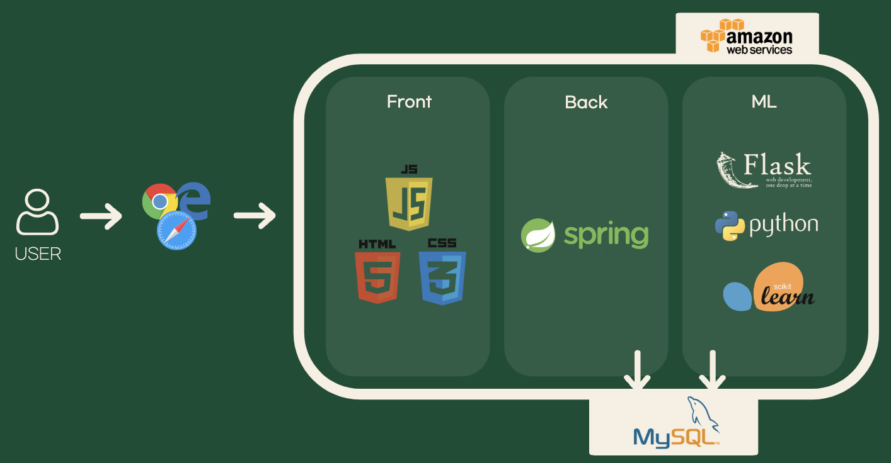
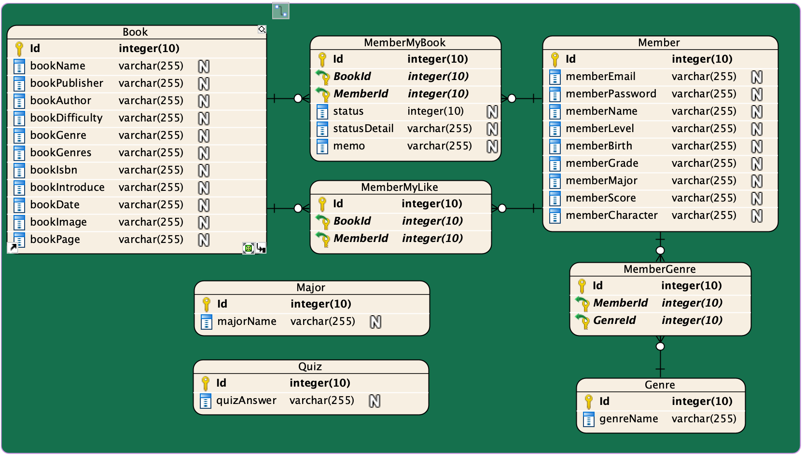

# 이화여자대학교 컴퓨터공학전공 캡스톤디자인프로젝트 그로쓰 02팀

> 프로젝트 주제 : 청소년 대상 어휘력/문해력/취향 맞춤형 도서 추천 서비스   
> 서비스 명 : GUIDE:BOOK    
> 팀명 : 가이드북   
> 프로젝트 기간 : 2023.03.02 ~ 2023.11.24   
> 배포 주소 : http://ewha02guidebook.cafe24.com

# 📚[GUIDE:BOOK](http://ewha02guidebook.cafe24.com)이란?

**청소년 대상 어휘력/문해력/취향 맞춤형 도서 추천 서비스**

- 회원가입 과정에서 **어휘력/문해력 테스트**를 통해 유저의 개인정보/선호 장르/관심 학과/어휘력 및 문해력 레벨을 바탕으로 도서를 추천합니다.
- **교육청 추천도서**및 **문화체육관광부 추천도서**를 기반으로 도서 데이터를 구성하였습니다.
- 책을 읽고 본인의 **독서 현황**을 수정할 수 있으며 특히 **독서 중단 사유**를 추천 알고리즘에 반영하였습니다.

# 👨‍👩‍👧‍👦팀원 소개

|     이름      |            역할             |                  Contact                  |
| :-----------: | :-------------------------: | :---------------------------------------: |
| 류한아 (리더)   |      BE, ML 모델 개발       |  [Github](https://github.com/AntBean94)     |
|    김지우     | FE                        |  [Github](https://github.com/kjw3757)       |
|    김지현     |    BE, 데이터베이스 관리     |  [Github](https://github.com/wlgus253254)     |

# 🗂️프로젝트 구조
## 📁기술 스택

|     분류      |                                                                                                                                        기술                                                                                                                                         |
| :-----------: | :---------------------------------------------------------------------------------------------------------------------------------------------------------------------------------------------------------------------------------------------------------------------------------: |
|   Front-end   |                                                                                                                                                                                                             |
|   Back-end    |     |
|      ML       |                                                                                                                                               |
|      DB       |                                                                                                                                                                                                                |

## 📁시스템 아키텍쳐

  

## 📁ERD

# 📚주요 기능

# 📺시연 영상

