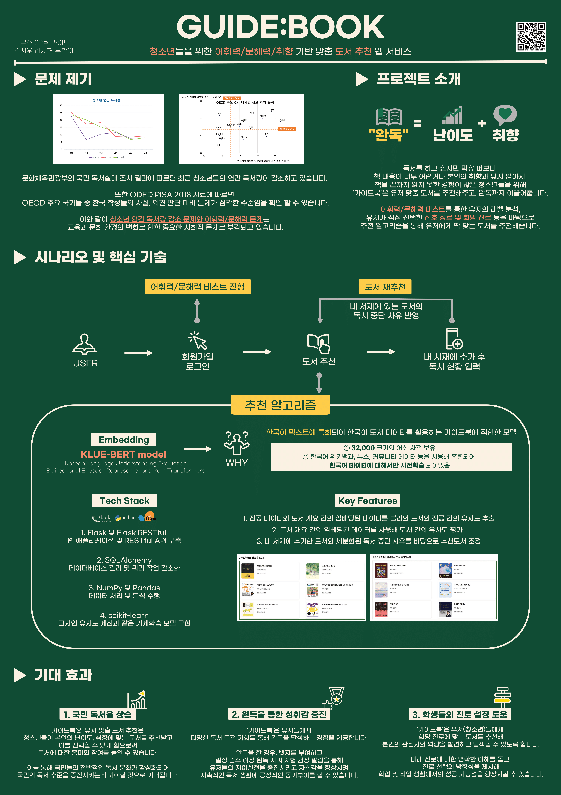

# 이화여자대학교 컴퓨터공학 캡스톤디자인프로젝트 그로쓰 02팀

> 프로젝트 주제 : 청소년 대상 어휘력/문해력/취향 맞춤형 도서 추천 서비스   
> 서비스 명 : GUIDE:BOOK    
> 팀명 : 가이드북   
> 프로젝트 기간 : 2023.03.02 ~ 2023.11.24   
> 배포 주소 : http://ewhaguidebook.com/

# 📚[GUIDE:BOOK](http://ewhaguidebook.com/)이란?

**청소년 대상 어휘력/문해력/취향 맞춤형 도서 추천 서비스**

- 회원가입 과정에서 **어휘력/문해력 테스트**를 통해 유저의 개인정보/선호 장르/관심 학과/어휘력 및 문해력 레벨을 바탕으로 도서를 추천합니다.
- **교육청 추천도서**및 **문화체육관광부 추천도서**를 기반으로 도서 데이터를 구성하였습니다.
- 책을 읽고 본인의 **독서 현황**을 수정할 수 있으며 특히 **독서 중단 사유**를 추천 알고리즘에 반영하였습니다.

# 👨‍👩‍👧‍👦팀원 소개

|     이름      |            역할             |                  Contact                  |
| :-----------: | :-------------------------: | :---------------------------------------: |
| 류한아 (리더)   |      BE, ML 모델 개발       |  [Github](https://github.com/hanadoolsae/)     |
|    김지우     | FE                        |  [Github](https://github.com/kjw3757)       |
|    김지현     |    BE, 데이터베이스 관리     |  [Github](https://github.com/wlgus253254)     |

# 🗂️프로젝트 구조
## 📁기술 스택

|     분류      |                                                                                                                                        기술                                                                                                                                         |
| :-----------: | :---------------------------------------------------------------------------------------------------------------------------------------------------------------------------------------------------------------------------------------------------------------------------------: |
|   Front-end   |                                                                                                                                                                                                             |
|   Back-end    |     |
|      ML       |                                                                                                                                               |
|      DB       |                                                                                                                                                                                                                |

## 📁시스템 아키텍쳐

  

## 📁ERD

# 📚주요 기능

## 회원가입

- 개인정보 입력, 선호 장르 선택, 관심 학과 선택, 어휘력 문해력 테스트 진행 후 사용자의 레벨을 확인할 수 있습니다. 

## 메인화면

- 개인별 맞춤 도서 및 사용자의 그룹(전공&학년) 내 선호도가 높은 추천 도서, 내 서재의 랜덤 책 한 권과 유사도가 높은 도서들을 확인할 수 있습니다. 

## 도서 검색 및 상세정보

- 키워드 검색시 해당 키워드가 제목 및 작가에 포함된 도서 목록을 출력하며, 도서를 선택하면 도서의 상세정보를 확인할 수 있습니다. 
- 도서 상세 정보에는 책 표지, 제목, 작가, 출판사, 장르, 난이도가 표시되고, 내 서재에 추가 및 찜하기 기능이 있습니다. 

## 마이페이지 및 독서 현황

- 회원정보와 함께 본인의 레벨이 표시되고, 개인정보를 수정할 수 있습니다. 재시험 기능이 있어 재시험이 가능하며, 내 서재에 담은 도서와 찜한 도서 목록을 확인할 수 있습니다. 
- 내 서재 속 도서들은 '독서중' '완독' '중단' '메모' 기능을 활용해 독서 현황을 기입할 수 있으며, 이때 '완독'과 '중단'사유는 추천 알고리즘에 반영됩니다. 

  

# 📺[시연 영상](https://www.youtube.com/watch?v=7KpBBu7_FRY)
## 📍영상 주요 내용
- 문제 제기 및 프로젝트 소개 
- 활용 기술 
- 시나리오 및 핵심 기능 
- 시연 
- 기대효과  

